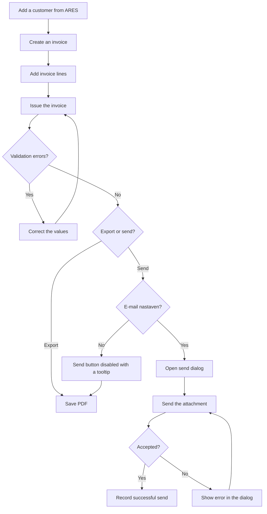

# Invoice workflow

```mermaid
flowchart TD
    A[Add a customer from ARES] --> B[Create an invoice]
    B --> C[Add invoice lines]
    C --> D[Issue the invoice]
    D --> E{Validation errors?}
    E -->|Yes| F[Correct the values]
    F --> D
    E -->|No| G{Export or send?}
    G -->|Export| I[Save PDF]
    G -->|Send| H{E-mail nastaven?}
    H -->|No| J[Send button disabled with a tooltip]
    J --> I
    H -->|Yes| K[Open send dialog]
    K --> L[Send the attachment]
    L --> M{Accepted?}
    M -->|Yes| N[Record successful send]
    M -->|No| O[Show error in the dialog]
    O --> L
```
