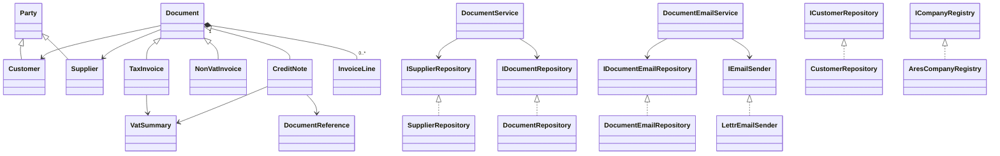

# Class diagram

```mermaid
classDiagram
    Party <|-- Customer
    Party <|-- Supplier
    Document <|-- TaxInvoice
    Document <|-- NonVatInvoice
    Document <|-- CreditNote
    Document "1" *-- "0..*" InvoiceLine
    Document --> Customer
    Document --> Supplier
    TaxInvoice --> VatSummary
    CreditNote --> VatSummary
    CreditNote --> DocumentReference
    DocumentService --> ISupplierRepository
    DocumentService --> IDocumentRepository
    DocumentEmailService --> IDocumentEmailRepository
    DocumentEmailService --> IEmailSender
    ISupplierRepository <|.. SupplierRepository
    ICustomerRepository <|.. CustomerRepository
    IDocumentRepository <|.. DocumentRepository
    IDocumentEmailRepository <|.. DocumentEmailRepository
    ICompanyRegistry <|.. AresCompanyRegistry
    IEmailSender <|.. LettrEmailSender
```
